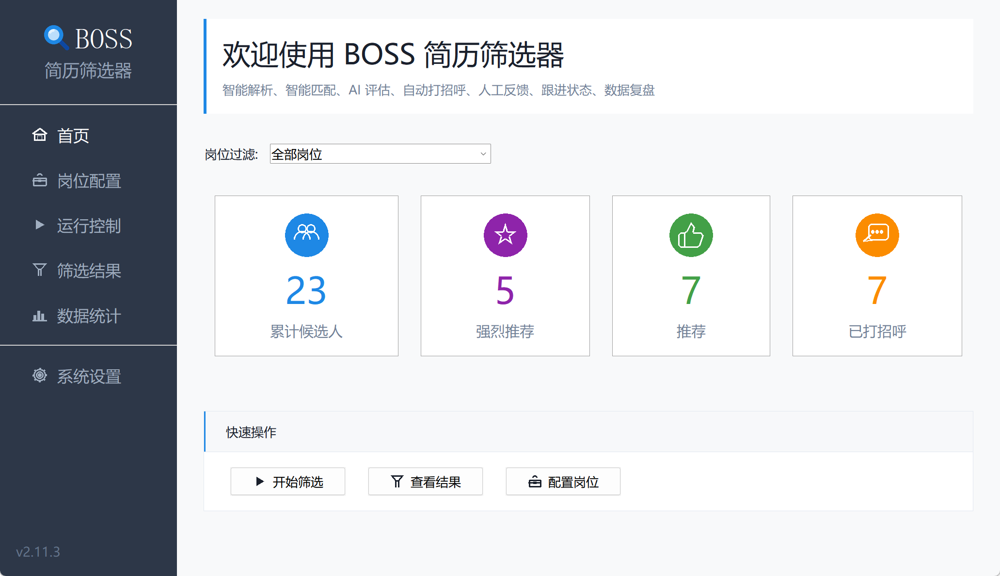
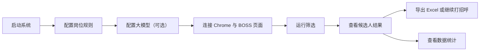
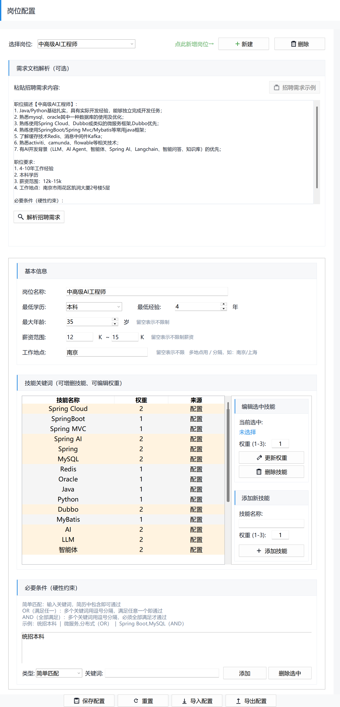
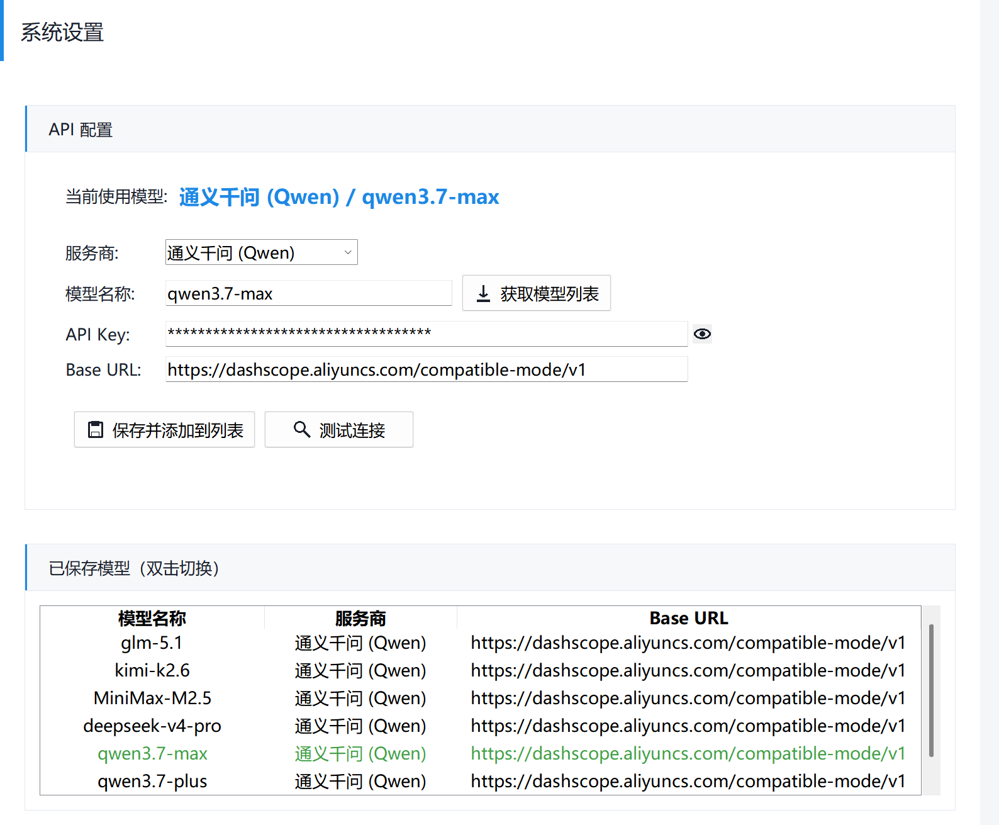
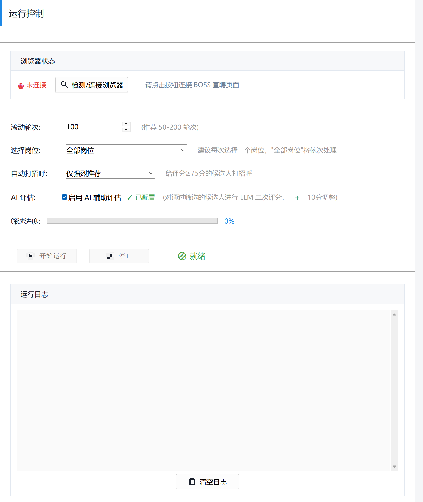
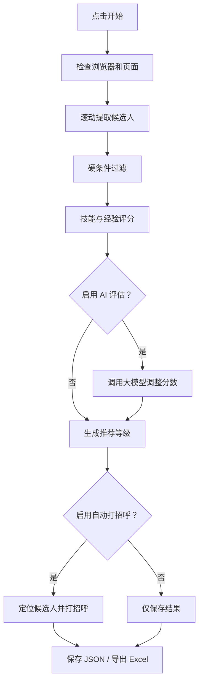
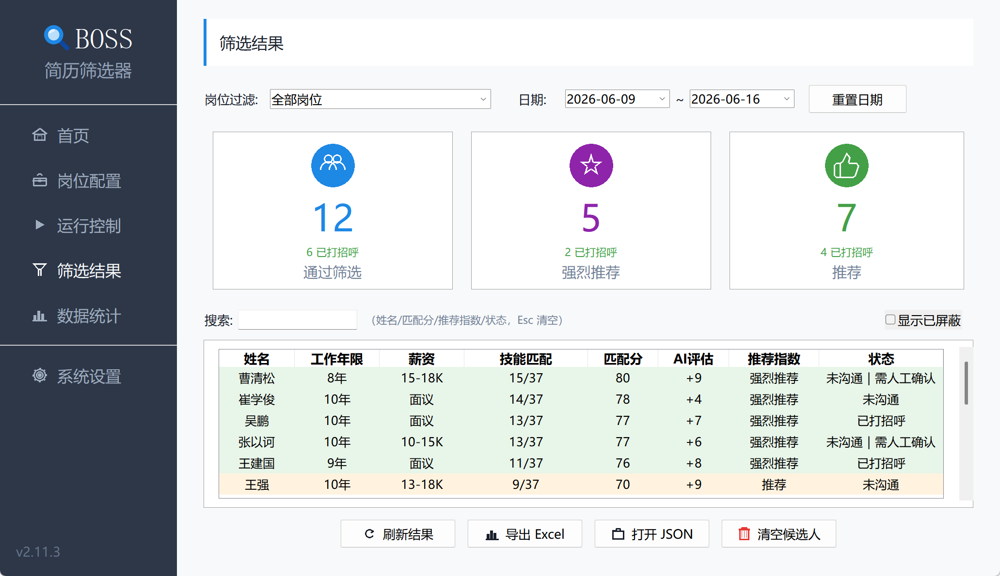
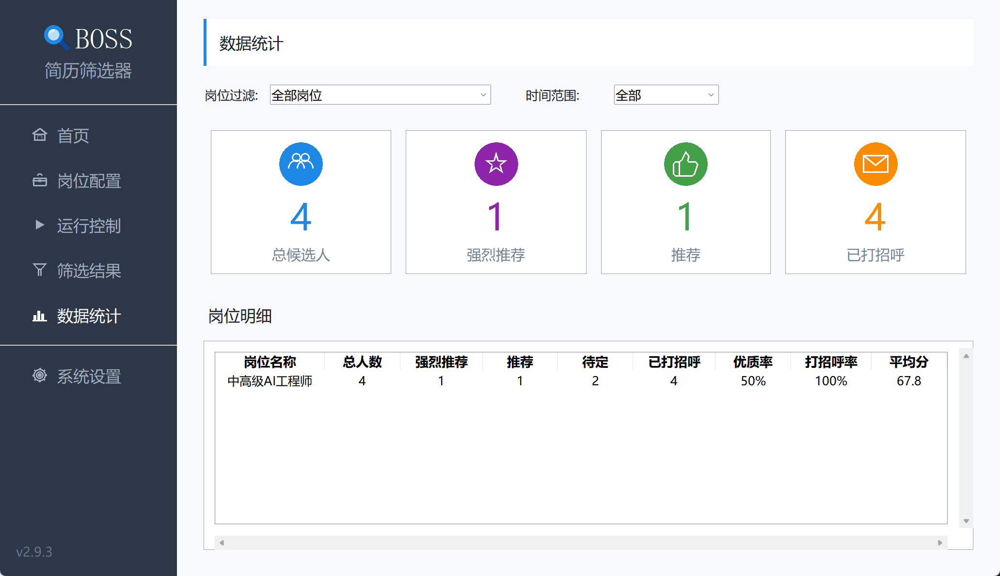
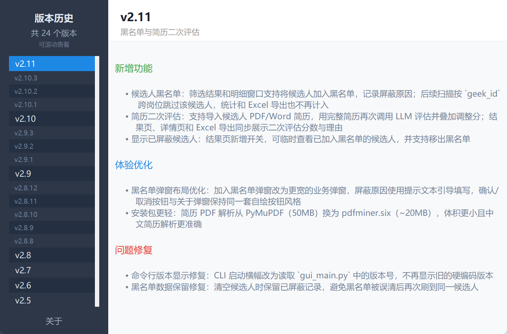
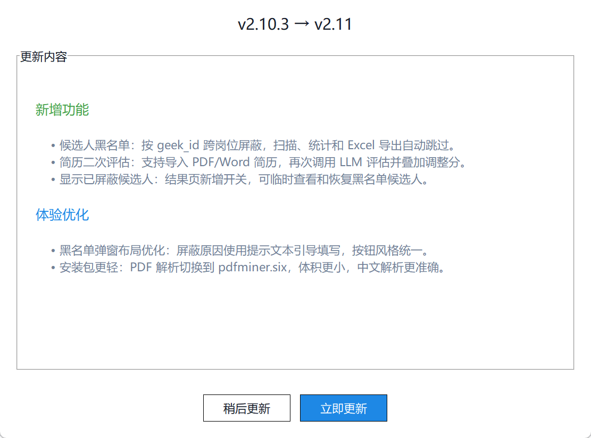

# BOSS 招聘系统操作说明（图文版）

适用版本：v2.9.3  
适用对象：使用图形界面完成岗位配置、候选人筛选、AI 辅助评估、自动打招呼和结果导出的用户。

本文只覆盖图形界面操作。命令行模式、打包发布、开发维护请查看项目根目录下的 `README.md`、`PACKAGING.md` 和 `AGENTS.md`。

## 一、系统能做什么

BOSS 招聘系统用于把 BOSS 直聘推荐候选人的获取、筛选、评分、打招呼和结果导出串成一个可重复执行的流程。

核心能力：

- 根据招聘需求自动生成岗位规则，并在可用时用 AI 增强解析结果。
- 根据岗位规则过滤候选人：学历、经验、年龄、薪资、工作地点、必要条件。
- 根据技能关键词、优先项和权重计算匹配分。
- 对通过基础筛选的候选人调用大模型做二次评估。
- 自动滚动 BOSS 推荐页面并提取候选人。
- 对符合阈值的候选人自动打招呼。
- 保存候选人数据，并导出 Excel。
- 按岗位查看筛选、推荐、打招呼统计。

## 二、主界面总览

启动后进入首页。左侧是固定导航栏，右侧是当前页面内容。

左侧导航含 6 个入口：

| 导航项 | 用途 |
| --- | --- |
| 首页 | 查看全局候选人统计和快捷入口 |
| 岗位配置 | 新建、修改、导入、导出岗位筛选规则 |
| 运行控制 | 连接浏览器、选择岗位、设置滚动轮次和打招呼策略 |
| 筛选结果 | 查看候选人列表、右键操作、导出 Excel |
| 数据统计 | 按岗位和时间范围统计筛选结果 |
| 系统设置 | 配置大模型服务商、API Key、模型列表和连通性 |

整体使用顺序如下：

## 三、启动系统

普通用户不要通过命令行启动，直接打开已经安装或打包好的程序。

### Windows

找到 `BOSS_ResumeFilter.exe`，双击打开。

如果系统弹出安全提示，确认文件来源是本项目打包产物后再允许运行。

### macOS

安装后在“应用程序”中打开 BOSS 简历筛选器 `.app`。

如果是从压缩包解压出来的版本，先把 `.app` 拖到“应用程序”，再双击打开。

启动成功后，窗口左下角会显示当前版本号，例如 `v2.9.3`。

## 四、首次使用流程

第一次使用不要直接点“开始筛选”。正确顺序是：

1. 先进入“岗位配置”，建立至少一个岗位规则。
2. 如果要启用 AI 辅助评估，进入“系统设置”配置大模型。
3. 进入“运行控制”，连接 Chrome 和 BOSS 直聘推荐页面。
4. 选择岗位、滚动轮次、打招呼策略。
5. 点击“开始”运行。
6. 进入“筛选结果”查看候选人。
7. 根据需要导出 Excel 或查看统计。

## 五、配置岗位规则

进入左侧“岗位配置”。

下图以项目当前已有的“中高级AI工程师”岗位为例，展示完整岗位配置界面。

### 1. 新建岗位

操作路径：

1. 点击页面上方“新建”。
2. 填写岗位名称。
3. 设置最低学历、最低经验、最大年龄、薪资范围、工作地点。
4. 添加技能关键词和权重。
5. 设置必要条件。
6. 点击“保存配置”。

岗位规则直接决定候选人会不会被淘汰。这里不要随手填，尤其是必要条件和工作地点。

### 2. 用招聘需求自动解析

如果手头有招聘 JD，可以使用“需求文档解析”区域：

1. 把招聘需求粘贴到文本框。
2. 如果不清楚招聘需求该写成什么样，先点击“招聘需求示例”，系统会填入一份需求模板。
3. 按模板结构修改岗位描述、职位要求、薪资、地点和必要条件。
4. 点击“解析招聘需求”。
5. 检查系统自动提取的岗位名称、经验、学历、薪资、地点、技能关键词、优先项和必要条件。
6. 明显不对的字段手工修正。
7. 保存配置。

解析流程会先用本地规则生成基础结果；如果“系统设置”中当前模型和 API Key 可用，会自动启用 AI 增强解析，补充和修正基本信息、技能关键词、优先项和必要条件。AI 暂时不可用、网络超时或模型响应异常时，系统会自动回退到本地规则解析。

v2.9.3 后，解析会主动过滤泛化词和噪声词，例如“人工智能”“证券行业”“数据清洗”等不会轻易被当成技术技能；学历、工作年限等基础门槛会归入基本信息，不再混进必要条件；“证券经验优先”“大模型 Agent 经验优先”等优先项会作为额外加分项，不会稀释普通技能关键词匹配分。

解析功能是辅助，不是最终裁决。保存前必须人工检查，尤其是薪资上下限、必要条件、技能关键词权重和优先项是否符合岗位真实要求。

### 3. 字段说明

| 字段 | 说明 |
| --- | --- |
| 岗位名称 | 当前岗位规则名称，也是运行时选择岗位的名称 |
| 最低学历 | 低于该学历的候选人直接淘汰 |
| 最低经验 | 工作年限不足直接淘汰 |
| 最大年龄 | 超过年龄上限直接淘汰；留空表示不限制 |
| 薪资范围 | 候选人期望薪资明显超出预算时淘汰 |
| 工作地点 | 支持多个地点，例如 `南京、上海/杭州` |
| 技能关键词 | 用于评分，不一定直接淘汰 |
| 优先项 | 作为额外加分项参与排序，不参与硬过滤 |
| 必要条件 | 不满足则直接淘汰，适合放“统招本科”等硬要求 |

### 4. 技能权重建议

| 权重 | 适用情况 |
| --- | --- |
| 1 | 普通加分项 |
| 2 | 核心技能 |
| 3 | 强核心技能，缺失会显著影响匹配判断 |

不要把所有技能都设成高权重。权重失真后，评分排序会失去意义。

“优先项”不是硬门槛。适合放“证券经验优先”“AI Agent 项目经验优先”“全栈经验优先”这类加分项；不适合放“必须统招本科”“必须 5 年以上经验”这类淘汰条件。

## 六、配置大模型

如果只做规则筛选，可以跳过本节。  
如果要启用“AI 辅助评估”，或希望招聘需求解析时使用 AI 增强结果，必须先进入左侧“系统设置”配置模型。

### 1. 配置步骤

1. 选择服务商，例如通义千问、DeepSeek、Kimi、OpenAI、Anthropic 或自定义。
2. 填写 Base URL。系统会按服务商给出默认地址，自定义服务商需要手工填写。
3. 输入 API Key。
4. 获取或输入模型名称。
5. 点击“测试连接”。
6. 测试通过后点击“保存并添加到列表”。

### 2. API Key 存储方式

API Key 加密保存在系统钥匙串中，`api_config.json` 不保存明文 Key。

同一服务商支持按 `provider + base_url` 区分不同接入方式。例如同一个服务商的 API 接入和 Token Plan 接入可以分别保存。

### 3. 模型列表

“获取模型列表”会从服务商拉取当前可用模型。模型选择弹窗支持：

- 搜索模型。
- 多选模型。
- 批量测试连通性。
- 识别新增模型和下线模型。

如果模型连通性失败，先检查三件事：API Key 是否正确、Base URL 是否正确、该模型是否已经开通。

## 七、连接 BOSS 直聘页面

进入左侧“运行控制”。

### 1. 连接浏览器

操作路径：

1. 点击“检测/连接浏览器”。
2. 系统会尝试连接或启动 Chrome。
3. 登录 BOSS 直聘账号。
4. 打开 BOSS 直聘“推荐牛人”页面。
5. 回到系统确认浏览器状态。

状态判断：

| 状态 | 含义 | 处理方式 |
| --- | --- | --- |
| 未连接 | 系统没有连到 Chrome | 点击检测/连接浏览器 |
| 需导航 | 已连接 Chrome，但不在推荐牛人页面 | 手工打开 BOSS 推荐页面 |
| 已连接 | 已连接到 BOSS 推荐页面 | 可以开始运行 |

### 2. BOSS 页面配合点

网页端需要人工配合的情况：

- 第一次登录账号。
- BOSS 要求短信、扫码或滑块验证。
- 需要切换到指定招聘职位的推荐页面。
- 页面结构变化导致选择器健康检查异常。

系统不会替你绕过验证码。出现验证时，先在浏览器里完成验证，再回到系统继续。

## 八、运行筛选

运行前检查：

- 浏览器状态应为“已连接”。
- BOSS 页面应停留在目标岗位的“推荐牛人”页面。
- “选择岗位”应与 BOSS 页面当前职位一致。
- 如果启用 AI 辅助评估，模型配置应已测试通过。

### 1. 运行参数

| 参数 | 建议 |
| --- | --- |
| 选择岗位 | 单岗位优先；“全部岗位”适合批量处理 |
| 滚动轮次 | 默认 100；少量测试可设 20-50 |
| AI 辅助评估 | 需要模型配置；会增加耗时和 token 成本 |
| 自动打招呼 | 首次测试建议先选“不打招呼（仅筛选）” |

### 2. 打招呼策略

| 策略 | 行为 |
| --- | --- |
| 不打招呼（仅筛选） | 只提取、评分、保存候选人 |
| 仅强烈推荐 | 只给 75 分及以上候选人打招呼 |
| 强烈推荐 + 推荐 | 给 65 分及以上候选人打招呼 |

建议新岗位第一次运行先“仅筛选”，确认规则没有误杀或误放后，再启用自动打招呼。

### 3. 运行过程

点击“开始”后，系统会：

1. 检查浏览器连接。
2. 检查当前页面是否是 BOSS 推荐页面。
3. 按岗位规则扫描候选人。
4. 自动滚动页面获取更多候选人。
5. 对候选人执行硬条件过滤和评分。
6. 需要时调用大模型二次评估。
7. 按打招呼策略发送消息。
8. 保存候选人数据并导出 Excel。

### 4. 停止运行

点击“停止”后，系统会发出停止信号，并在关键循环中保存当前进度。  
不要直接关闭窗口来中断任务，除非程序已经无响应。

## 九、查看筛选结果

进入左侧“筛选结果”。

### 1. 结果列表

候选人列表显示的是达到保留分数线的候选人，重点字段包括：

| 字段 | 含义 |
| --- | --- |
| 姓名 | 候选人名称 |
| 经验 | 工作年限 |
| 薪资 | 期望薪资 |
| 匹配分 | 规则评分和 AI 调整后的最终分 |
| 推荐指数 | 强烈推荐、推荐、待定 |
| AI 评估 | 大模型调整分和评估摘要 |
| 状态 | 跟进状态（未沟通/已打招呼/已回复/待约面/已约面/不合适/已归档）和人工反馈标记 |
| 技能匹配 | 命中的技能关键词 |

推荐等级：

| 分数 | 等级 |
| --- | --- |
| 75 分及以上 | 强烈推荐 |
| 65-74 分 | 推荐 |
| 55-64 分 | 待定 |
| 55 分以下 | 默认不进入结果统计 |

### 2. 常用操作

| 操作 | 说明 |
| --- | --- |
| 刷新结果 | 从 `candidates_all.json` 重新加载 |
| 导出 Excel | 生成或更新 `candidates_all.xlsx` |
| 打开 JSON | 用默认程序打开候选人数据文件 |
| 清空候选人 | 清理当前岗位或全部岗位候选人，操作前会备份 |

### 3. 右键菜单

在候选人行上右键，可以执行：

- 查看详情（含评分拆解、评分解释、命中证据、跟进状态、人工反馈）。
- 对未打招呼候选人单独打招呼。
- 更新跟进（未沟通/已打招呼/已回复/待约面/已约面/不合适/已归档 + 备注）。
- 标记反馈（合适/误推/误杀/放弃 + 备注）。
- 移除此人。
- 导出选中候选人。

单独打招呼会尝试在 BOSS 当前列表页自动滚动定位候选人卡片。定位失败时，先确认浏览器仍在对应岗位的推荐页面。

## 十、查看数据统计

进入左侧“数据统计”。

### 1. 统计范围

可以按两个维度过滤：

| 过滤项 | 说明 |
| --- | --- |
| 岗位过滤 | 查看全部岗位或单个岗位 |
| 时间范围 | 今天、本周、全部 |

### 2. 指标含义

| 指标 | 含义 |
| --- | --- |
| 总候选人数 | 分数不低于 55 的候选人数 |
| 强烈推荐 | 75 分及以上 |
| 推荐 | 65-74 分 |
| 待定 | 55-64 分 |
| 已打招呼 | 已发送沟通消息的候选人数 |
| 已反馈 | 已标记有效人工反馈（合适/误推/误杀/放弃）的候选人数 |
| 合适率 | 合适人数 / 已反馈人数 |
| 误推率 | 误推人数 / 已反馈人数 |
| 已回复 | 跟进状态为已回复、待约面或已约面的候选人数 |
| 回复率 | 已回复人数 / 已打招呼及后续跟进状态人数 |
| 已约面 | 跟进状态为已约面的候选人数 |
| 约面率 | 已约面人数 / 已回复及后续跟进状态人数 |
| 优质率 | 强烈推荐和推荐在候选人中的占比 |
| 打招呼率 | 已打招呼候选人的占比 |
| 平均分 | 当前统计范围内候选人的平均匹配分 |

数据统计适合看岗位规则质量和跟进转化。如果误推率高，优先检查关键词、优先项和必要条件；如果合适率高但回复率低，优先检查打招呼话术或岗位吸引力。

## 十一、数据文件

常见数据文件：

| 文件 | 用途 |
| --- | --- |
| `job_config.json` | 岗位规则配置 |
| `api_config.json` | 大模型配置，不含明文 API Key |
| `candidates_all.json` | 候选人累积数据 |
| `candidates_all.xlsx` | Excel 导出结果 |
| `selectors.json` | BOSS 页面选择器配置 |

候选人数据按 `(geek_id, job_name)` 去重。相同候选人在不同岗位下会保留为不同记录。

## 十二、版本与自动更新

### 1. 查看当前版本

当前版本显示在窗口左下角，例如 `v2.9.3`。

点击左下角版本号，可以打开版本历史或更新日志，查看当前版本新增了什么、优化什么、修复了什么。

### 2. 自动更新检查

系统启动后会延迟检查是否有新版本。检查逻辑是后台执行的，不影响正常操作。

更新来源：

| 更新源 | 用途 |
| --- | --- |
| Gitee | 国内优先更新源，通常更快 |
| GitHub | 备用更新源，用于复核和兜底 |

发现新版本后，系统会弹出更新提示。用户可以选择立即更新，也可以稍后再说。

### 3. Windows 更新方式

Windows 版更新流程：

1. 系统下载新版 `.exe`。
2. 校验文件大小和 SHA256。
3. 关闭旧程序。
4. 替换为新版程序。
5. 自动重新启动。

如果更新后没有自动启动，手工双击 `BOSS_ResumeFilter.exe` 即可。

### 4. macOS 更新方式

macOS `.app` 版本会下载新版压缩包，替换应用后重新打开。

如果系统提示权限或安全限制，按 macOS 安全提示处理；不要把 `.app` 放在临时下载目录长期运行，建议放到“应用程序”。

### 5. 更新失败时怎么处理

按这个顺序处理：

1. 关闭当前程序，重新打开一次，看是否继续提示更新。
2. 检查网络是否能访问 Gitee 或 GitHub。
3. 如果下载失败，稍后再试，系统会自动退避重试。
4. 如果校验失败，不要手工改文件，重新触发下载。
5. 如果自动更新始终失败，下载最新安装包或可执行文件后手工替换。

自动更新只更新程序本体，不应该删除你的岗位配置、候选人数据和 API Key。

## 十三、常见问题处理

### 1. 点击开始后提示未连接

处理顺序：

1. 回到“运行控制”。
2. 点击“检测/连接浏览器”。
3. 确认 Chrome 已启动。
4. 确认 Chrome 打开的是 BOSS 推荐牛人页面。
5. 再点击“开始”。

### 2. 浏览器已连接，但提示需要导航

原因是系统连到了 Chrome，但当前页面不是 BOSS 推荐牛人页面。  
在 Chrome 中打开目标岗位的推荐牛人页面，再回到系统。

### 3. BOSS 弹出验证码

系统会暂停等待。处理顺序：

1. 在浏览器中完成验证码。
2. 回到系统提示框。
3. 选择继续等待或继续运行。

如果浏览器里没有看到验证码，可能是误报，可以跳过等待继续运行。

### 4. AI 评估失败

优先检查：

1. API Key 是否保存。
2. Base URL 是否正确。
3. 模型名称是否真实可用。
4. 该模型是否在服务商后台开通。
5. 额度是否耗尽。

不要先改岗位规则。AI 失败和规则筛选是两条链路。

### 5. 候选人很少或质量很差

按这个顺序排查：

1. BOSS 当前职位是否选对。
2. 岗位工作地点是否过窄。
3. 必要条件是否过硬。
4. 技能关键词是否过少或过偏。
5. 滚动轮次是否太低。
6. BOSS 推荐池本身是否已经没有更多候选人。

### 6. Excel 没有更新

进入“筛选结果”，点击“导出 Excel”。  
如果仍没有变化，先点击“刷新结果”，确认 `candidates_all.json` 中确实有新候选人。

## 十四、推荐操作习惯

第一次跑新岗位：

1. 先只配置规则。
2. 打招呼策略选“不打招呼（仅筛选）”。
3. 滚动轮次设为 20-50。
4. 看结果里的误杀、误放。
5. 调整岗位规则。
6. 再开启“仅强烈推荐”打招呼。

日常跑成熟岗位：

1. 检查浏览器连接。
2. 确认 BOSS 当前职位。
3. 运行筛选。
4. 查看筛选结果。
5. 导出 Excel。
6. 查看数据统计，判断规则是否需要微调。

## 十五、快速检查清单

运行前：

- 岗位规则已保存。
- BOSS 网页端已登录。
- Chrome 已连接。
- 当前页面是目标岗位的推荐牛人页面。
- 系统里的“选择岗位”和 BOSS 页面职位一致。
- AI 评估需要的模型已测试通过。
- 第一次跑新岗位时未直接启用大范围自动打招呼。

运行后：

- 筛选结果页已刷新。
- Excel 已导出。
- 数据统计已查看。
- 异常候选人已通过详情或 JSON 核对。
- 必要时备份 `candidates_all.json`。
